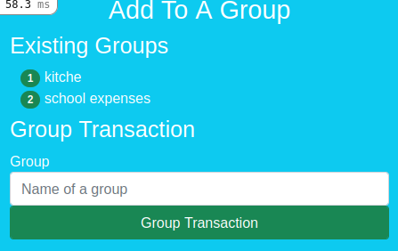

# Transaction Group
An app for grouping transactions by goals. A simple authentication form is used to create a user and log in. The app allows you to create a transaction, create a group and then add the transaction to multiple groups.

## App Home Page

## App log in

## App transaction view

## App group view

## App add view group

## Prerequisite
- PostgreSQL

## Getting Started :
- Clone the repository: `git clone` git@github.com:widzthedvloper/Transaction_Group.git
- Move inside the club-house folder: `cd Transaction_Groupe`
- Run: `rails db:create` and `rails db:migrate`.
- Run the server: `rails s` or `rails server`
- To see the app on your local machine open your browser and type: `localhost:3000`. Have fun !!!

## BUILT WITH

    -HTML
    -CSS
    -bootstrap
    -Ruby
    -Ruby on Rails
    -Postgres as the database, make sure you have it installed on your local machine.

##  AUTHORS

👤 **Widzmarc Jean Nesly Phelle**

- GitHub: [@widzthedvloper](https://github.com/widzthedvloper)
- Twitter: [@widzthedvloper](https://twitter.com/widzthedvloper)
- LinkedIn: [@widzthedvloper](https://www.linkedin.com/in/widzmarc-jean-nesly-phelle-252a26129/)

## SHOW YOUR SUPPORT
Give a :star: if you like this project!

## 📝 LICENSE
This project is [MIT](/LICENSE) licensed
